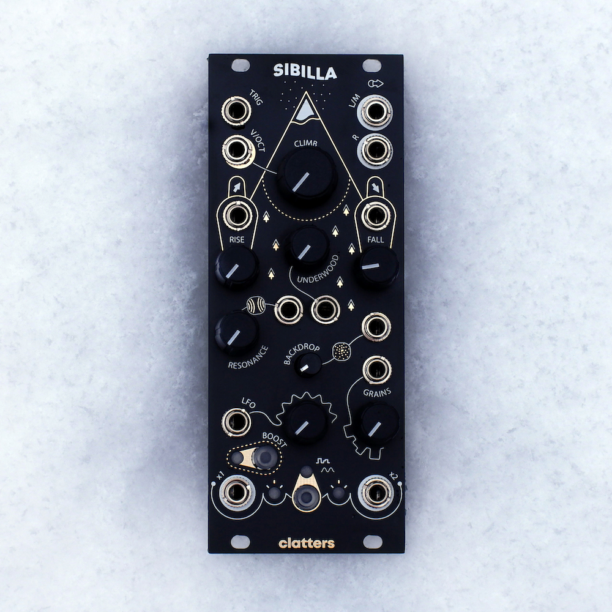

# Sibilla

Sibilla is a 10HP digital stereo oscillator in the eurorack format based on a DSP platform that can easily be updated via USB without the need for external programs. 



During its development we had to take so many decision in terms of signal routing, compromise stuff to achieve more playability, and many times we were forced to choose only one great idea from the many cool possibility we had in mind. So, why not gradually releasing alternative firmwares to the original one? Why not seeing what other people are capable of?

## Story and introduction

Sibilla is a digital stereo oscillator that aims to traslate into music the beauty and harshness of a semi-barren mountain. Its sound is sculpted by various saw and sine waves running through intricate delay networks, altered by LFOs, white noises and creating constructive and destructive interferences.

Both stereo channels are the output stages of two feedback audio loops.
Each loop is made up by a main sub sinusoidal wave oscillator and two saw and sine waves with frequencies affected by the generation of harmonics (right channel) and subharmonics (left channel). All waves have different phases whose offset is constantly affected by minor variations created by two pairs of grains randomly fluctuating within the waves amplitude spectrum and being sampled at a certain speed.
Waves then meet to each other to a common point, together with two white noise sources, creating constructive and destructive interferences constantly affected by two LFOs movements.
Interferences are then run into a resonant low pass filter and then distributed to four different delay lines from which they are fed back into the audio loops at different time intervals depending on the grains movements.

#### Current draw
- +12V: 125mA;
- -12V: 30mA;
- +5V: 0mA;

Please note that the above current consumption is highly influenced by the code Sibilla is running and refers to the Sibilla v.1.0 firmware.

Visit the [Sibilla product page](https://clattersmachines.com/prodotto/sibilla/) and the [downloads](https://clattersmachines.com/users-manual/) section of Clatters website for more.

## Firmware development

Sibilla is based on a Patch Submodule: a DSP platform for eurorack synthesizers created by Electrosmith. 
It's based on a STM32 M7 processor at 480MHz, 96kHz / 24-bit audio and RAM for up to 10 minute audio buffers.
You can experiment with new codes and ideas and restore the Clatters official firmware whenever you want with a few clicks by following [these steps](https://github.com/Clatters/Sibilla/blob/main/Official%20firmwares/README.md#update-your-sibilla)

### Coding resources

If you want to try writing your own code, the [DaisyWiki](https://github.com/Clatters/DaisyWiki) page is the best place to start.

[libDaisy](https://github.com/Clatters/libDaisy) is a hardware abstraction library for the Daisy Audio Platform that provides easy access to things such as Audio, Controls, GPIO, MIDI, USB communication, and more.

### Multimedia programming languages

Sibilla can also be programmed with multimedia programming languages like [PureData](https://puredata.info/) and [Max/MSP Gen~](https://cycling74.com/products/max).
To do that, you'll need some utilities that allow you to convert your patches into Daisy projects: 
[Pd2dsy](https://github.com/Clatters/pd2dsy) and [Oopsy](https://github.com/Clatters/oopsy) will be your best friends.

We highly suggest you to give it a try, it's super fun and that's actually how the first Sibilla audio prototype was born!

Please consider the fact that, at the moment, not all the PureData objects are supported by Heavy hvcc compiler. You can refer to this list of not-supported objects but do note this is non-exhaustive and may be not fully up to date. Please report any missing pd-vanilla objects.

#### Message Objects

```list
append
array
bag
choice
clone
cputime
drawcurve
drawnumber
drawpolygon
drawsymbol
drawtext
element
expr
filledcurve
filledpolygon
fudiformat
fudiparse
get
getsize
glist
key
keyname
keyup
list
makefilename
namecanvas
netreceive
netsend
openpanel
oscformat
oscparse
plot
pointer
realtime
savepanel
savestate
scalar
set
setsize
soundfiler
stdout
struct
switch
sysexin
tabread4
template
text
textfile
v
value
```

#### Signal Objects

```list
bang~
block~
bob~
bonk~
complex-mod~
expr~
fexpr~
fft~
framp~
hilbert~
ifft~
log~
loop~
lrshift~
pd~
print~
readsf~
rev1~
rev2~
rev3~
rfft~
rifft~
scope~
sigmund~
vline~
writesf~
```

